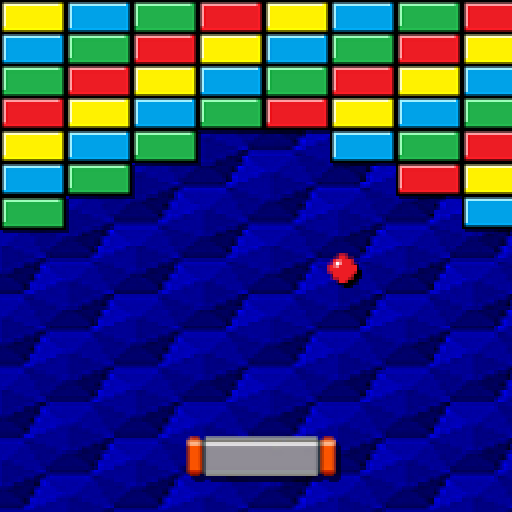

# Brick Breaker com Controle de Gestos

## Descrição
Este projeto é um jogo de Brick Breaker (Quebrador de Tijolos) inovador que utiliza a detecção de gestos para controlar a raquete. Utilizando Python, Pygame para a interface do jogo, OpenCV para processamento de imagem da webcam, e MediaPipe para detecção de gestos, este jogo oferece uma experiência interativa única.

## Funcionalidades
- **Controle de Gestos**: Utilize movimentos da mão para mover a raquete no jogo.
- **Detecção de Gestos com MediaPipe**: Detecta gestos da mão em tempo real usando a webcam.
- **Jogo de Brick Breaker Clássico**: Jogue o clássico jogo de quebrar tijolos com uma nova virada.
- **Interface Gráfica com Pygame**: Uma interface gráfica atraente e intuitiva.
- **Reinício do Jogo com Gestos**: Recomece o jogo juntando o polegar e o indicador.

## Requisitos
- Python 3.x
- Pygame
- OpenCV
- MediaPipe

## Instalação
```bash
pip install pygame opencv-python mediapipe
